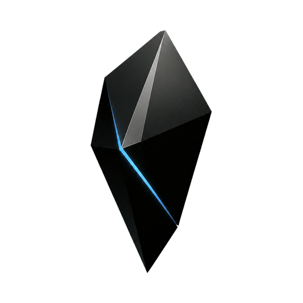
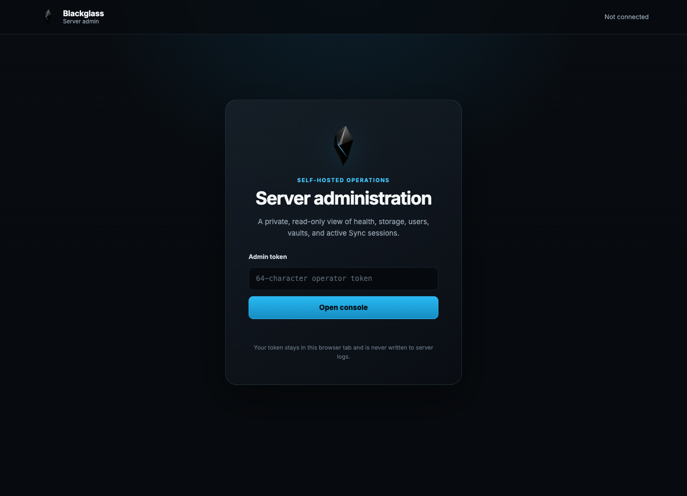
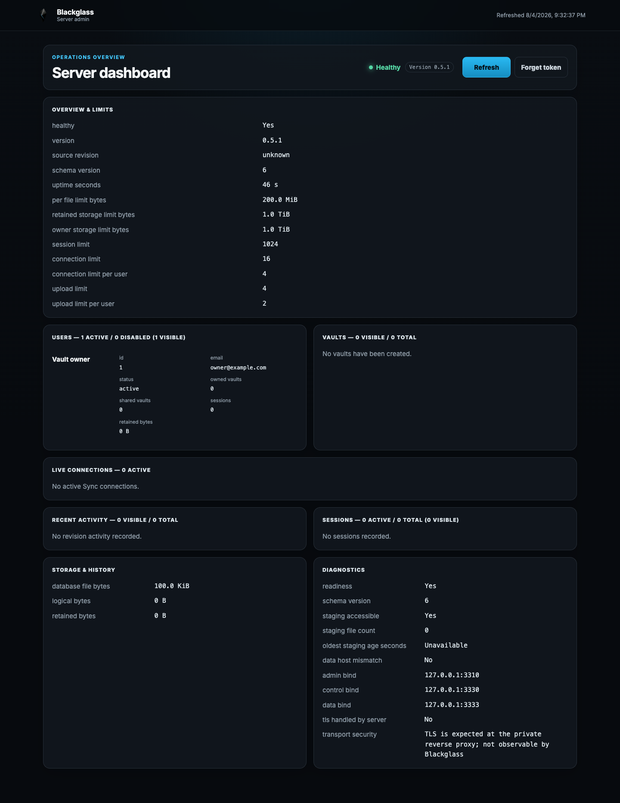

<p align="center">
  
</p>

<h1 align="center">Blackglass Server</h1>

Blackglass Server is a lean Rust/SQLite replacement for the hosted Sync service
used by a [Blackglass Bridge](https://github.com/mergebloom/blackglass-bridge)-adapted
Obsidian desktop application. The intended outcome is native desktop Sync with
a server, domains, TLS, database, attachments, backups, and retention entirely
under the operator’s control.

It requires no Blackglass-operated service, sends no telemetry, and has no
required outbound application dependency. SQLite and staged/blob data live in
one portable data root. Custom client-managed E2EE and managed encryption,
owner/collaborator/outsider isolation, revocation, reinvitation, self-leave,
and clean-device recovery are implemented and exercised by the companion
conformance suite.

## Supported scope

The initial platform is Linux server deployment on amd64 or arm64 with the
companion Apple Silicon macOS Bridge. Sync, custom client-managed E2EE, managed
encryption, sharing, membership lifecycle, and clean-device recovery are the
product flow. Exact renderer/Bridge/Server combinations are listed only in the
Bridge's generated [compatibility matrix](https://github.com/mergebloom/blackglass-bridge/blob/main/compatibility/MATRIX.md).
Windows, Linux desktop, Intel Mac, mobile clients, and unrelated Obsidian
services are future work and are not claimed here.

## Deploy with Docker Compose

Requirements: a 64-bit Linux Docker host, Docker Compose, two DNS names pointed
at the host, and inbound ports 80/443. Copy the example and pin a published
version or image digest:

```sh
cp .env.example .env
chmod 0600 .env
${EDITOR:-vi} .env
./ops/compose-ops.sh config
```

Create the initial account before exposing the service. The password is read
only from standard input:

```sh
read -r -s BLACKGLASS_INITIAL_PASSWORD
printf '%s\n' "$BLACKGLASS_INITIAL_PASSWORD" | \
  ./ops/compose-ops.sh init owner@example.com 'Vault owner'
unset BLACKGLASS_INITIAL_PASSWORD
./ops/compose-ops.sh up
./ops/compose-ops.sh health
```

Caddy obtains TLS certificates for the exact control and data domains. The
Server runs as uid/gid 65532 with a read-only root filesystem, dropped
capabilities, bounded memory/PIDs/file descriptors, a native readiness probe,
graceful shutdown, and one explicit persistent data volume. Plaintext service
ports remain loopback-only on the Linux host.

Export and test a verified online backup:

```sh
./ops/compose-ops.sh backup /safe/off-host/blackglass.sqlite
./ops/compose-ops.sh verify-backup /safe/off-host/blackglass.sqlite
./ops/compose-ops.sh restore-drill /safe/off-host/blackglass.sqlite
```

The [production guide](docs/production.md) covers monitoring, account changes,
scheduled off-host backups, real recovery, upgrades, schema migration, and
rollback. Back up and run a restore drill before changing an image digest.

## Administration

The optional read-only admin console runs on its own loopback-only listener. It
shows service health, configured limits, storage, users, vaults, live Sync
connections, sessions, and recent activity. Its operator token remains in the
current browser tab and is never stored by the console or written to logs. See
the [production guide](docs/production.md#read-only-admin-console) for secure
access and configuration.





## Standalone Linux artifacts

Releases provide separate static-musl executables and compressed archives for
`linux-amd64` and `linux-arm64`, adjacent checksums, resource reports, license
notices, `SHA256SUMS`, and multi-architecture OCI metadata. Every executable
reports its semantic version and embedded source revision:

```sh
shasum -a 256 -c blackglass-server-vVERSION-linux-amd64.sha256
chmod 0755 blackglass-server-vVERSION-linux-amd64
./blackglass-server-vVERSION-linux-amd64 --version
./blackglass-server-vVERSION-linux-amd64 build-info
```

See [distribution](docs/distribution.md) for archive verification, provenance,
container digests, local builds, supported Linux hosts, and systemd installation.

## Develop and validate

```sh
npm ci
bun run check
```

The production service is Rust; Bun is development/test orchestration only.
Release builders use immutable Git source, locked Rust dependencies,
digest-pinned build inputs, reusable architecture-specific caches, and exact
artifact verification. The test suite covers protocol behavior, authentication,
authorization, quotas, database durability and corruption handling, migration,
backup/recovery, resource gates, Linux packaging, OCI publication metadata,
and dependency/license notices.

## Project boundary

This repository owns the Rust service, SQLite schema and migrations,
Linux/container release artifacts, deployment, backup, restore, and operations.
The Bridge repository owns official-client inspection, local adaptation, macOS
packaging, client artifacts, E2E orchestration, and the exact compatibility
matrix. Server protocol evidence is linked into those client release claims;
client implementation details are not duplicated here.

The public repository contains no Obsidian application, ASAR, extracted source,
proprietary assets, credentials, private domains, vault data, or private
deployment details. Repository and release gates scan that boundary.

Obsidian is a third-party product. Blackglass is independent and is not
affiliated with or endorsed by Obsidian. Users must supply their own legitimate
Obsidian installation to the companion Bridge. This is a distribution note,
not a legal conclusion.

Blackglass began as a research project exploring frontier LLM capabilities in
software analysis, compatibility engineering, implementation, and end-to-end
validation. Support claims remain tied to deterministic conformance evidence.

## Documentation

| Guide | Purpose |
| --- | --- |
| [Production](docs/production.md) | Secure configuration, operations, backup, upgrade, rollback |
| [Distribution](docs/distribution.md) | Linux binaries, archives, OCI image, verification |
| [Security](docs/security.md) | Threat model and controls |
| [Architecture](docs/architecture.md) | Rust/SQLite service design |
| [Protocol](docs/protocol/obsidian-1.12.7.md) | Observed Sync contract |
| [Validation](docs/validation/README.md) | Preserved protocol and scenario evidence |

See [CONTRIBUTING.md](CONTRIBUTING.md), [SECURITY.md](SECURITY.md), and the
[MIT License](LICENSE).
